Android_Templates
========================

- [Android_Templates](#android_templates)
- [Overview](#overview)
  - [Basic Activity](#basic-activity)
  - [Bottom Navigation Activity](#bottom-navigation-activity)
  - [Empty Compose Activity](#empty-compose-activity)
  - [Empty Compose Activity](#empty-compose-activity-1)
  - [Empty Activity](#empty-activity)
  - [Fullscreen Activity](#fullscreen-activity)
  - [Google AdMob Ads Activity](#google-admob-ads-activity)
  - [Login Activity](#login-activity)
  - [Primary/Detail Flow](#primarydetail-flow)
  - [Navigation Drawer Activity](#navigation-drawer-activity)
  - [Responsive Activity](#responsive-activity)
  - [Settings Activity](#settings-activity)
  - [Scrolling Activity](#scrolling-activity)
  - [Tabbed Activity](#tabbed-activity)
  - [Fragment + ViewModel](#fragment--viewmodel)

# Overview
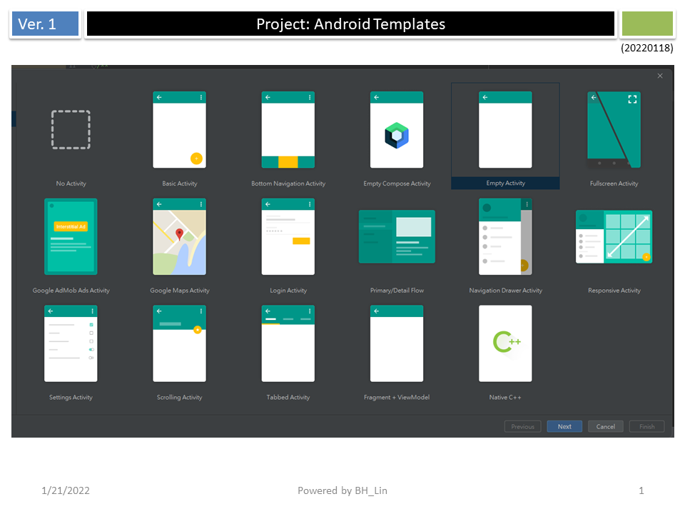

## Basic Activity
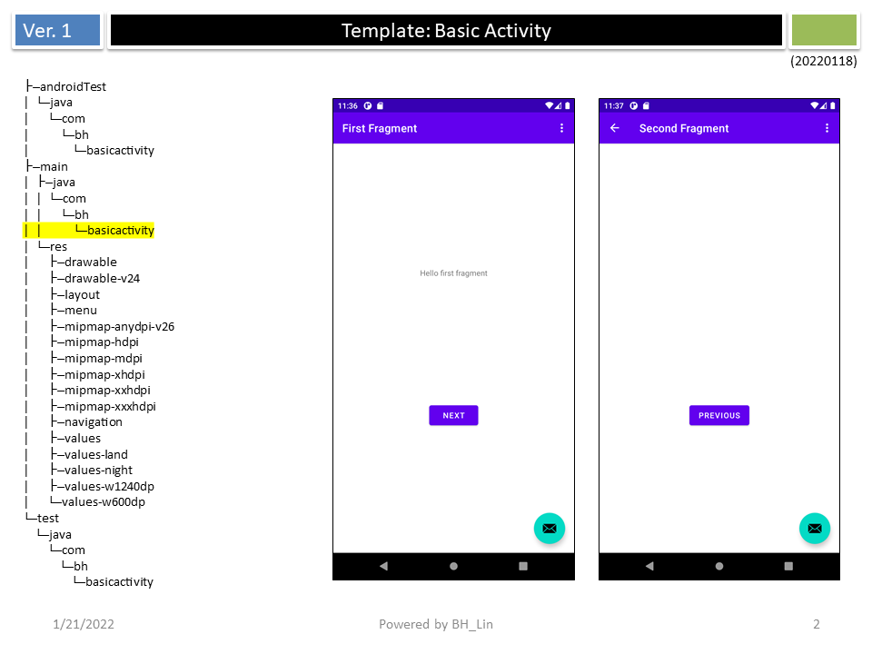

## Bottom Navigation Activity

## Empty Compose Activity
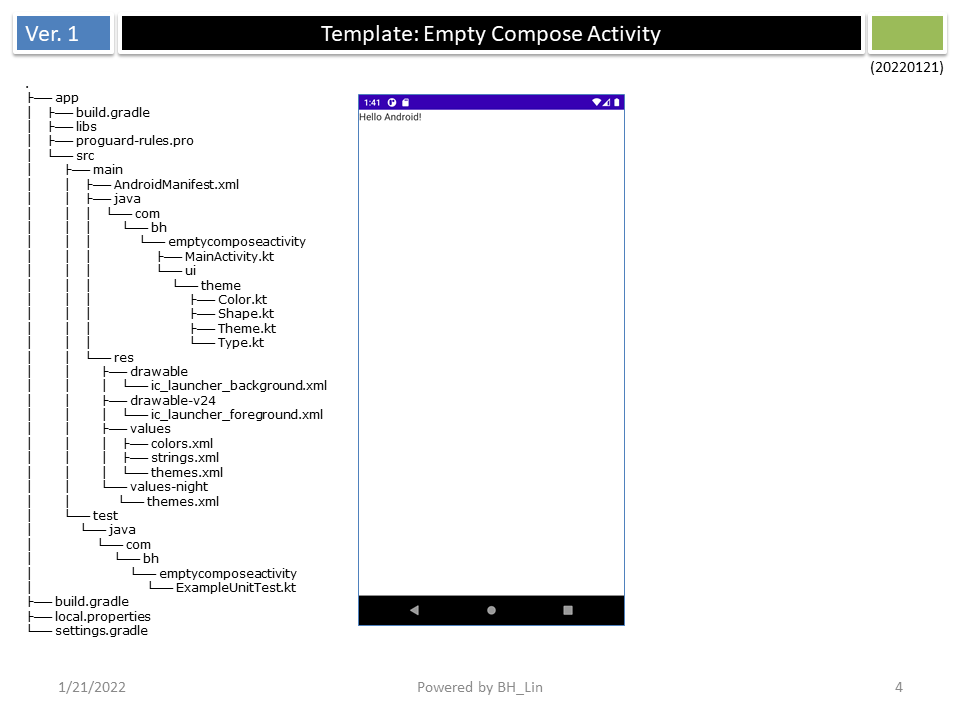

## Empty Compose Activity

## Empty Activity

## Fullscreen Activity
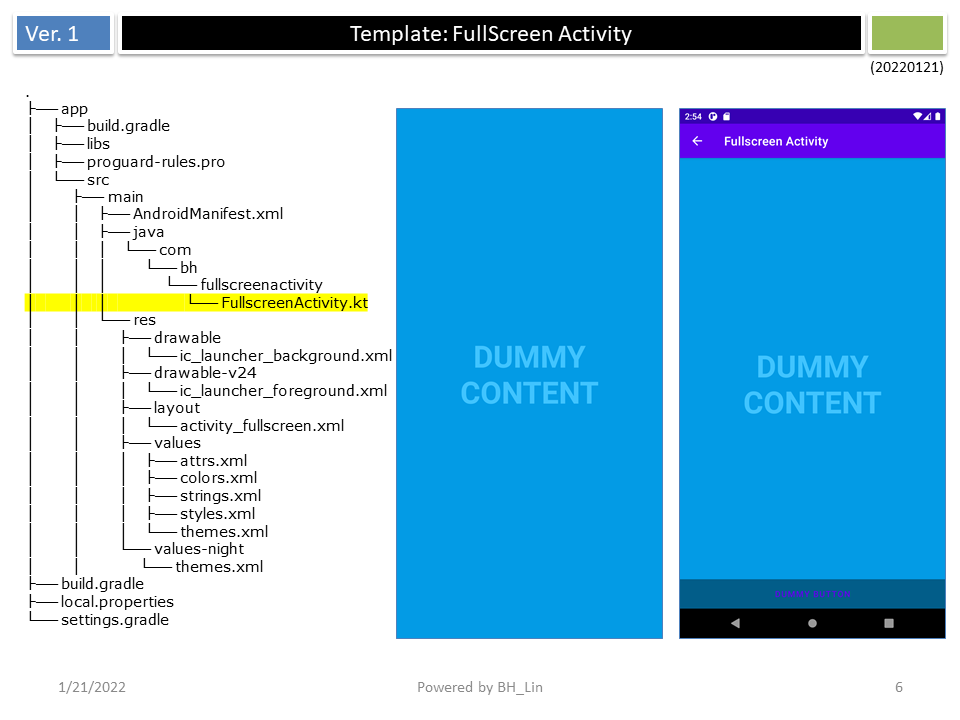

## Google AdMob Ads Activity
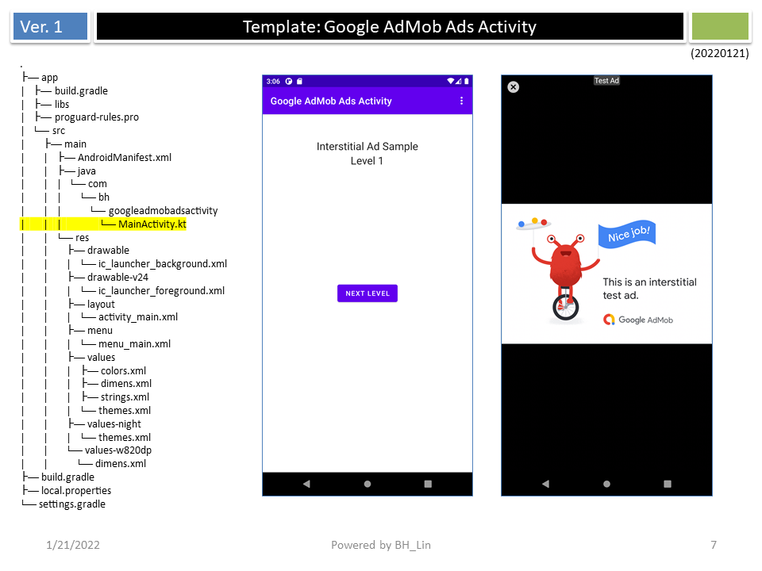

## Login Activity
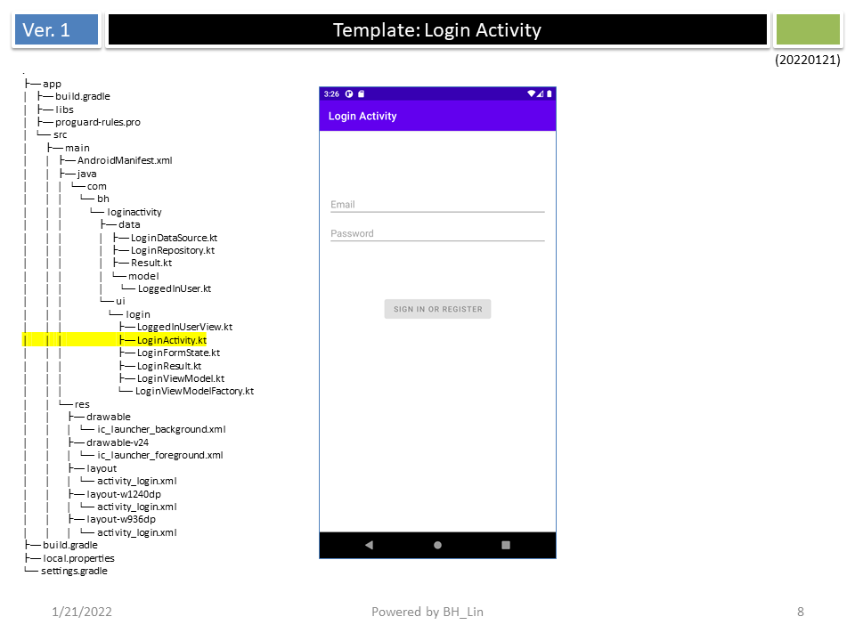

## Primary/Detail Flow
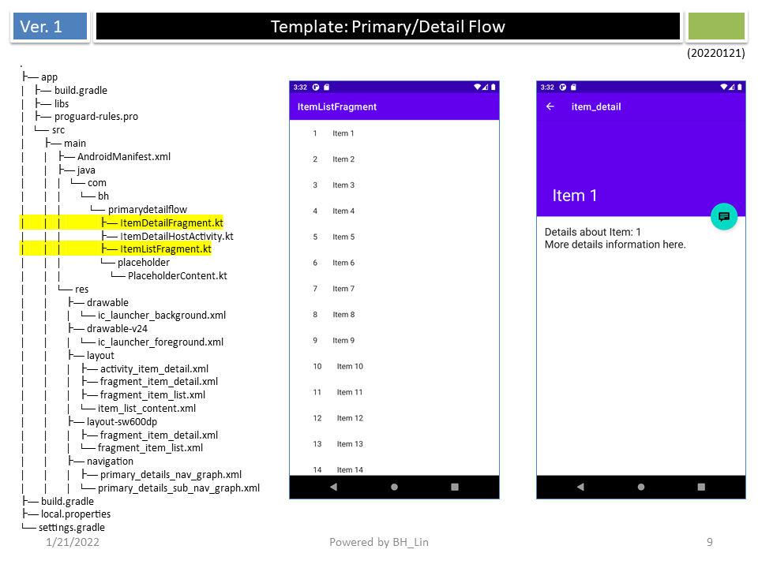

## Navigation Drawer Activity
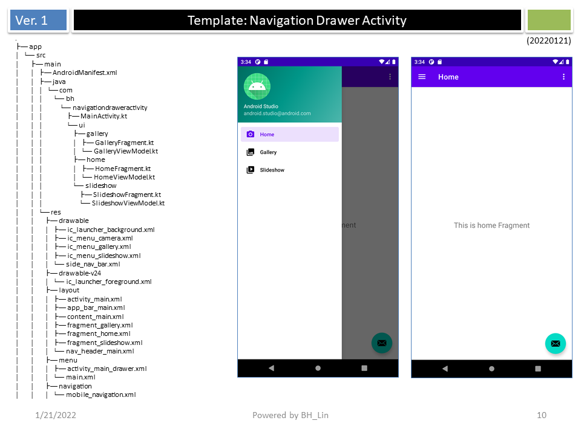

## Responsive Activity
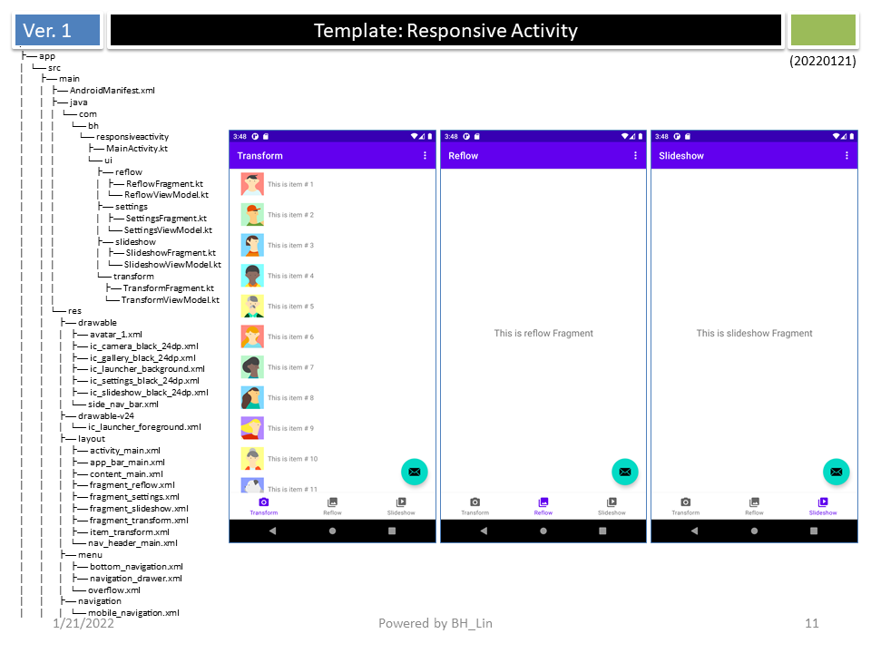

## Settings Activity
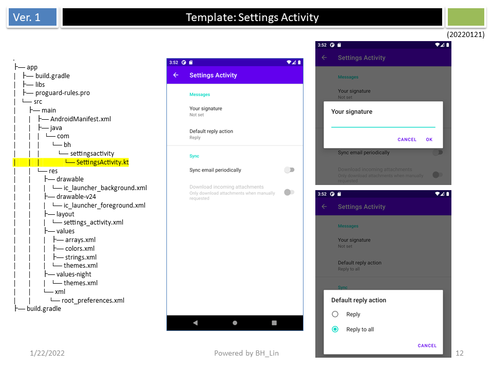

## Scrolling Activity
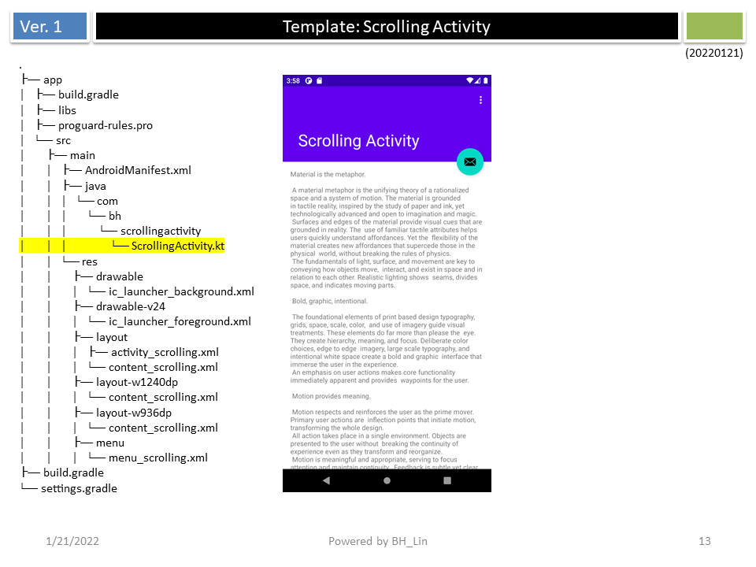

## Tabbed Activity
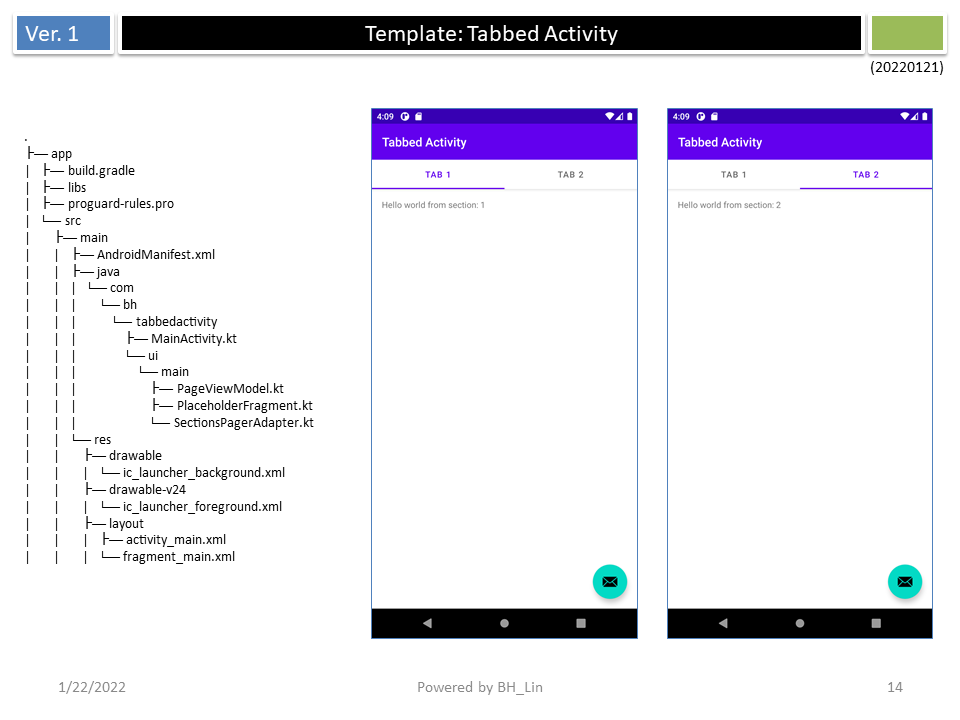

## Fragment + ViewModel
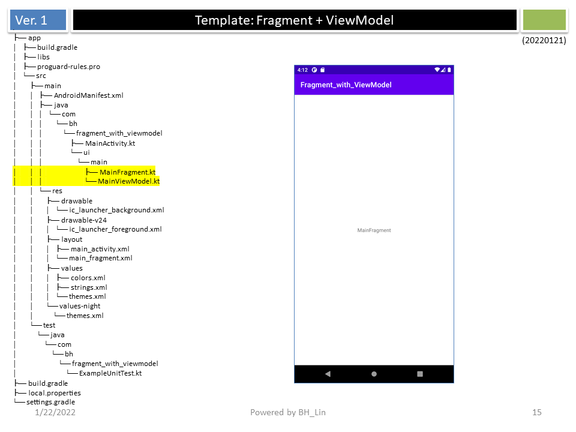
